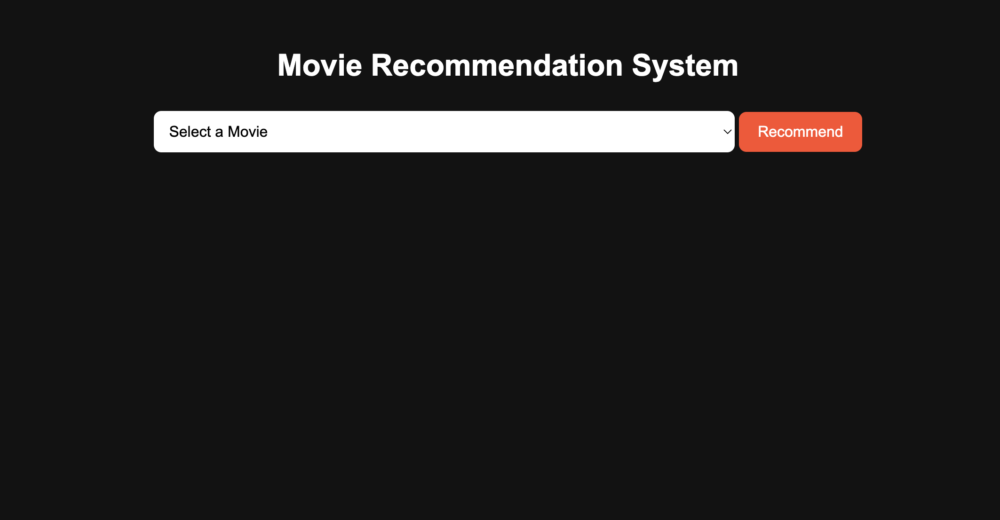
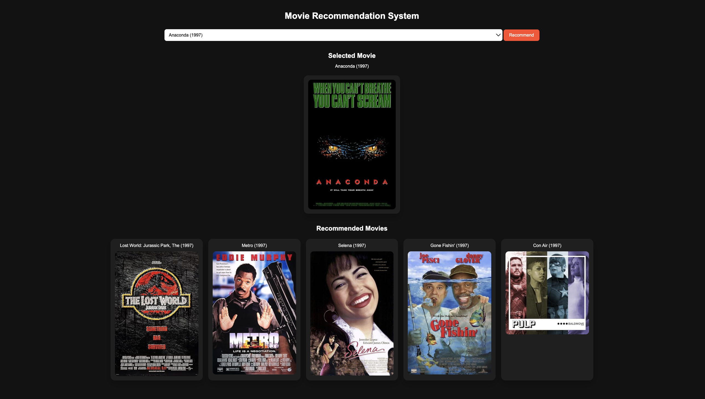
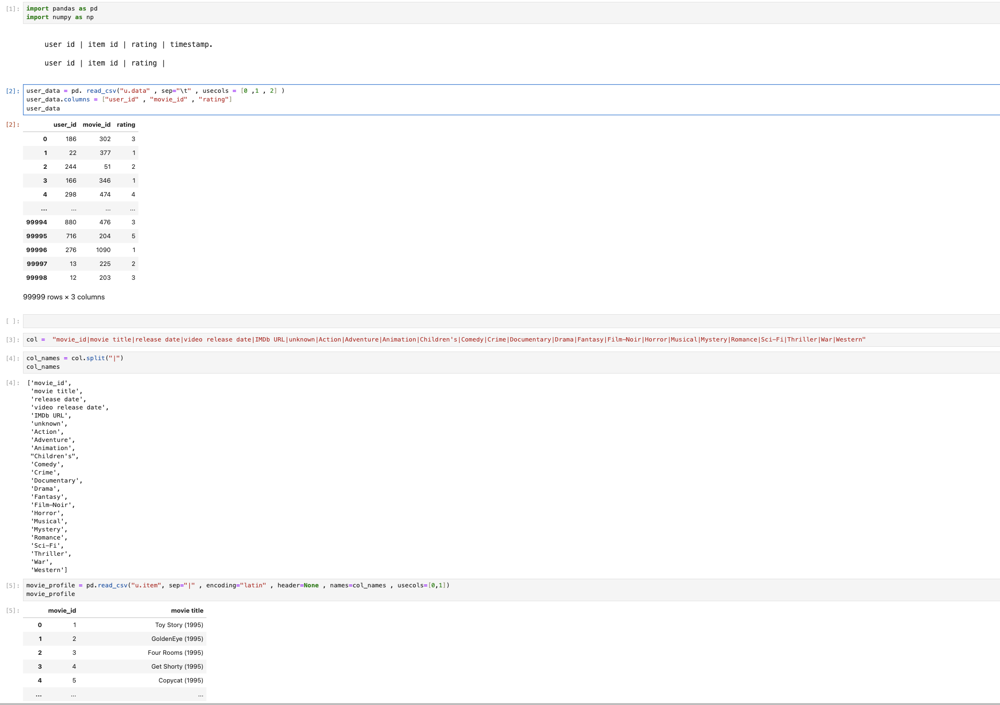
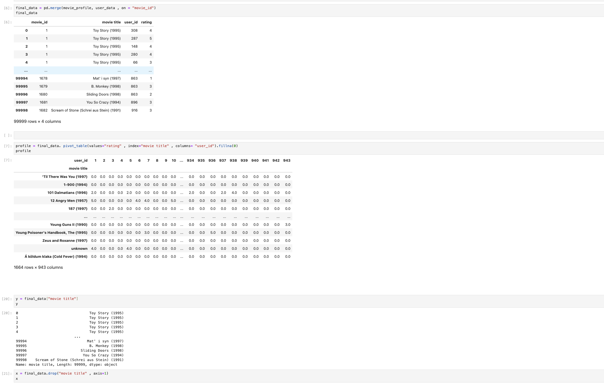
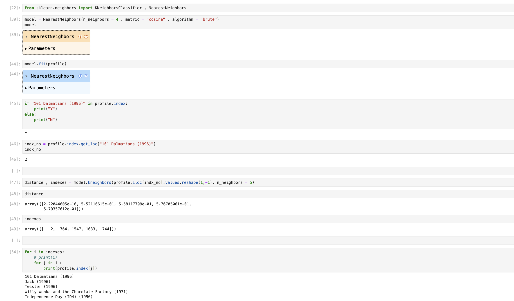

# Movie Recommendation System

## Project Overview
This is a Flask-based movie recommendation web app that uses collaborative filtering and cosine similarity to suggest movies similar to a selected title. The app also fetches movie poster images from the OMDb API.

## Features
- Flask web application with template rendering
- Movie selection dropdown and recommendation list
- Collaborative filtering using user ratings data
- Nearest Neighbors model with cosine similarity
- OMDb API integration for movie poster lookup
- Model training and serialized model/data storage with pickle

## Technology Stack
- Python 3
- Flask
- pandas
- NumPy
- scikit-learn
- requests
- pickle

## Data Files
- `u.data` — user ratings dataset
- `u.item` — movie metadata dataset
- `knn_model.pkl` — trained NearestNeighbors model
- `movies.pkl` — movie-user pivot table
- `movie_list.pkl` — list of movie titles for UI dropdown

## API Key Used
- OMDb API key: `***********`
- The key is used in `app.py` to fetch movie poster data from the OMDb API.

## Setup and Run
1. Install dependencies:

```bash
pip install -r requirements.txt
```

2. Train the recommender model:

```bash
python train_model.py
```

3. Start the Flask app:

```bash
python app.py
```

4. Open your browser and visit:

```bash
http://127.0.0.1:5000/
```

## File Summary
- `app.py` — Flask application, recommendation route, API poster lookup
- `train_model.py` — trains the movie recommender using NearestNeighbors
- `requirements.txt` — project dependencies
- `templates/index.html` — front-end movie recommendation UI
- `static/style.css` — custom styling for the web app

## Screenshots
Below are sample screenshots from the app interface:

- Home screen
  
- Recommended movies view
  

* jupyter code 
  
  
  
  
## Notes
- If you already have `knn_model.pkl`, `movies.pkl`, and `movie_list.pkl`, you can skip `train_model.py` and run `app.py` directly.
- The OMDb API key is hardcoded in `app.py` and can be replaced with your own key for production use.

